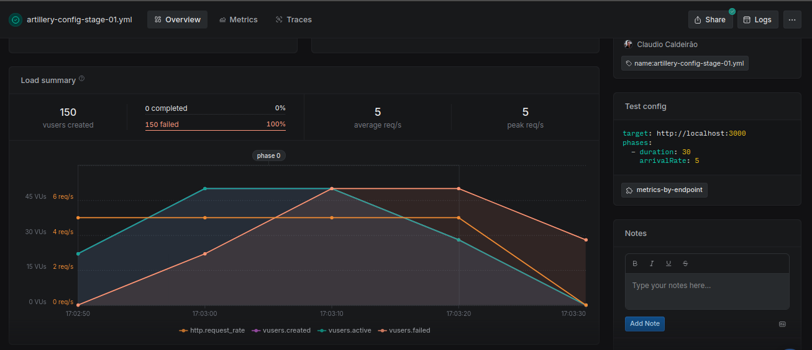
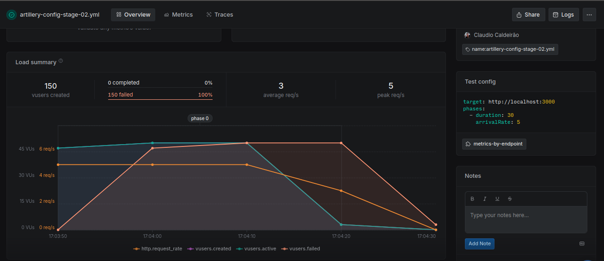
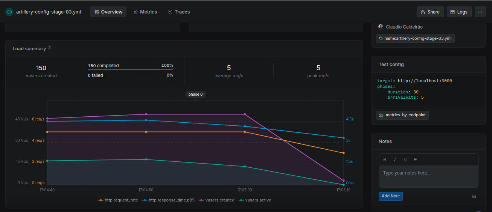
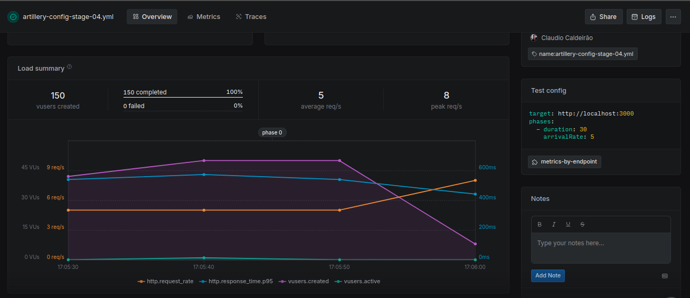
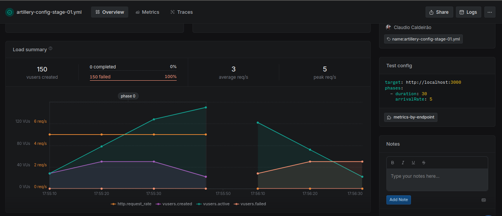
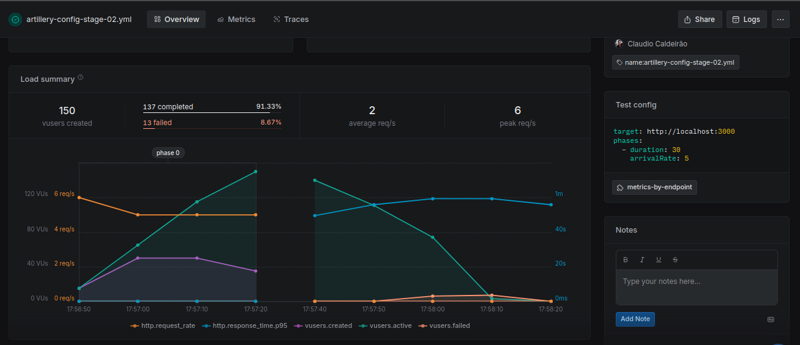

# 📊 Load Test Comparison — Orders by Stage

This document presents the comparison of load test results for each `/orders?stage=X` endpoint using **Artillery**.

## 🧪 Test Setup

- **Tool**: Artillery
- **Test Duration**: 30 seconds
- **Arrival Rate**: 5 virtual users (VUs) per second
- **Total Scenarios**: 4 (one for each `stage`)

> All stages were tested with the **same load configuration** to ensure consistent and fair comparison.

## 📈 Results Summary

| Stage | Status       | Behavior                  | Notes                                           |
| ----- | ------------ | ------------------------- | ----------------------------------------------- |
| 1     | ❌ Timeout   | No response within 10s    | All requests timed out (default timeout = 10s)  |
| 2     | ❌ Timeout   | No response within 10s    | Same as stage 1                                 |
| 3     | ✅ Completed | Handled the load normally | Response times acceptable under configured load |
| 4     | ✅ Completed | Extremely fast responses  | Performed significantly faster than stage 3     |

## 📈 Artillery.io Dashboard

#### Stage01



#### Stage02



#### Stage03



#### Stage04



## 📌 Interpretation

- **Stages 1 and 2**: Likely have performance bottlenecks, deadlocks, or missing resources causing full request timeouts.
- **Stage 3**: Performs within acceptable parameters under low traffic; could be a good baseline.
- **Stage 4**: Indicates high efficiency; may be optimized or under much less processing load.

## ✅ Recommendations

- Investigate timeout causes in **Stage 1 and 2** (application logs, DB latency, blocking calls).
- Consider using **Artillery's `http.timeout` setting** to capture longer delays if needed.
- Use **Stage 3 as baseline**, and **Stage 4 as benchmark** for future optimizations.
- Add metrics collection (CPU, memory, DB query time) during tests for deeper insight.

## 📂 Test YAML Used

```yaml
config:
  target: "http://localhost:3000"
  phases:
    - duration: 30
      arrivalRate: 5
scenarios:
  - flow:
      - get:
          url: "/orders/{customerId}?stage={stageId}"
```

## 🧪 Running the benchmark again but increasing timeout to get stage01 and stage02 response time

Running the same load tests but now with an aditional parameter to increse timeout only on stages 01 and 02:

```yaml
http:
  timeout: 60
```

## 📈 Results

#### Stage01

Still failed on every request.



#### Stage02

137 out of 150 requests completed successfully, but really poor performance.

