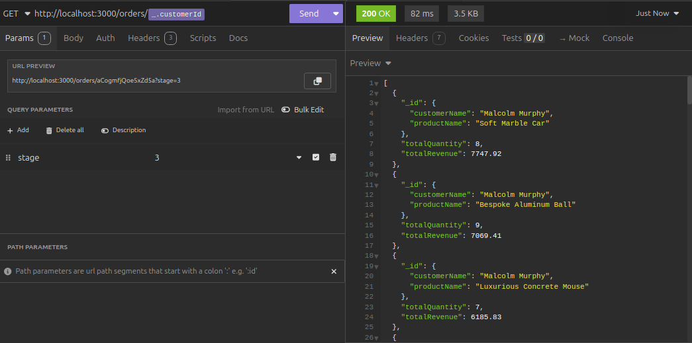
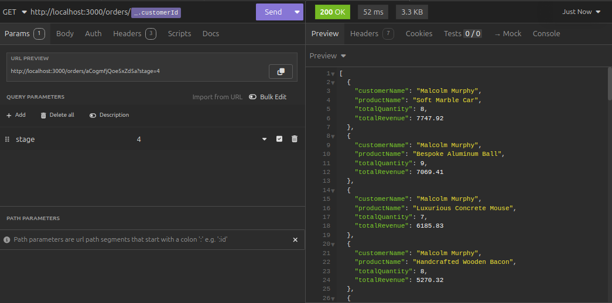

# Stages Comparison With Single Request

This document summarizes the performance and structure comparison of 4 aggregation stages tested with a **single curl request**.

---

## Stage 01 - BadAggregation

**Description:**  
The initial naive aggregation uses multiple `$lookup` stages with excessive joins and no filtering optimization. This results in poor performance and high resource consumption.

---

## Stage 02 - ImprovedAggregation

**Description:**  
This stage improves the pipeline by reordering stages, removing unnecessary `$lookup`s`$unwind`s, and optimizing `$project` by merging with `$group` step. The data flow is more efficient but without indexing yet.

---

## Stage 03 - Add Indexes on ImprovedAggregation

**Description:**  
Here, indexes are added on critical fields used in `$match` and `$lookup` stages. This dramatically improves query speed by reducing full collection scans.

---

## Stage 04 - Denormalized Data with Compound Index

**Description:**  
The final stage restructures data into a single denormalized collection, reducing joins entirely. A compound index is applied to support the query pattern efficiently. This stage shows the best performance.
